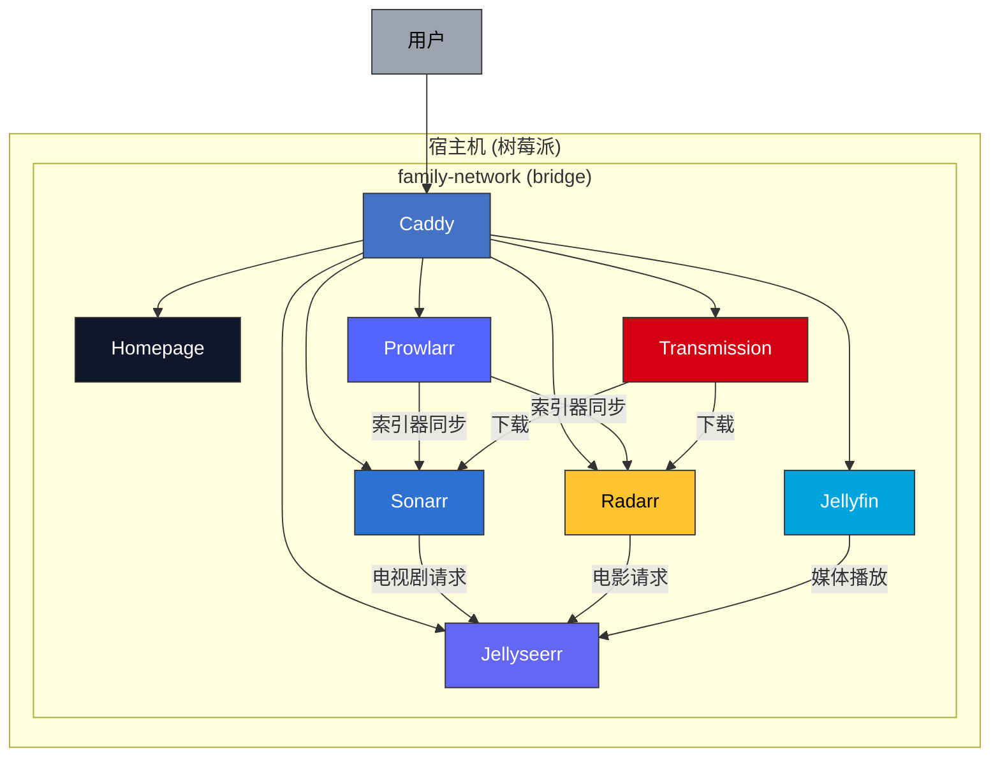

# Viewing Assist Kit

家庭媒体服务 Docker Compose 编排项目，运行在树莓派上。

## 服务列表

| 服务 | 功能 | 端口 |
|------|------|------|
| Jellyfin | 媒体服务器 | 8096 |
| Sonarr | 电视剧管理 | 8989 |
| Radarr | 电影管理 | 7878 |
| Prowlarr | 索引器管理 | 9696 |
| Transmission | BT 下载 | 9091 |
| Jellyseerr | 媒体请求管理 | 5055 |
| Homepage | 服务仪表盘 | 3000 |
| Caddy | 反向代理（域名模式） | 80, 443 |

## 架构



## 快速开始

### 一键部署（推荐）

```bash
# 端口模式（默认，无需域名）
./scripts/deploy.sh -q 192.168.1.100

# 域名模式（需要配置 DNS）
./scripts/deploy.sh -q 192.168.1.100 -m domain

# 交互式部署
./scripts/deploy.sh
```

部署脚本会自动：
- 检查前置条件（Docker、端口、磁盘空间）
- 生成配置文件和目录结构
- 创建 Docker 网络
- 按依赖顺序启动服务
- **自动配置服务关联**（开箱即用）

### 部署模式

| 模式 | 访问方式 | 适用场景 |
|------|----------|----------|
| **port** (默认) | `http://IP:端口` | 内网直接访问 |
| **domain** | `https://域名` | 需要配置 DNS/hosts |

### 命令行参数

```
-q, --quick <ip>      快速部署
-m, --mode <mode>     部署模式: port 或 domain
-d, --data <path>     数据根目录（默认: /srv/media）
-D, --domain <domain> 域名后缀（默认: home.local）
-u, --user <uid>:<gid> 运行用户（默认: 1000:1000）
--skip-setup          跳过服务关联自动配置
--dry-run             仅生成配置，不启动服务
```

## 服务关联配置

部署完成后，以下关联会自动配置：

| 关联 | 说明 |
|------|------|
| Prowlarr → Sonarr/Radarr | 索引器同步 |
| Transmission → Sonarr/Radarr | 下载客户端 |
| Jellyfin → Jellyseerr | 媒体服务器 |
| Sonarr/Radarr → Jellyseerr | 请求目标服务 |

手动重新配置：

```bash
./scripts/setup-services.sh
```

## 手动部署

```bash
# 1. 创建网络
docker network create family-network

# 2. 配置环境变量
cp .env.example .env
# 编辑 .env 填入实际值

# 3. 启动服务
./scripts/start-all.sh

# 4. 配置服务关联（可选）
./scripts/setup-services.sh
```

## 管理命令

```bash
./scripts/start-all.sh                  # 启动所有服务
./scripts/stop-all.sh                   # 停止所有服务
./scripts/setup-services.sh             # 重新配置服务关联

cd services/<服务名> && docker compose up -d    # 启动单个服务
cd services/<服务名> && docker compose down     # 停止单个服务
cd services/<服务名> && docker compose logs -f  # 查看日志
```

## 目录结构

```
├── services/              # Docker Compose 配置（每个服务一个目录）
├── scripts/
│   ├── deploy.sh          # 一键部署脚本
│   ├── setup-services.sh  # 服务关联配置
│   ├── start-all.sh       # 启动所有服务
│   ├── stop-all.sh        # 停止所有服务
│   └── lib/               # 工具库
└── docs/                  # 文档
```

## 环境变量

| 变量 | 必填 | 说明 | 示例 |
|------|------|------|------|
| `DATA_DIR` | ✅ | 数据根目录 | `/mnt/media` |
| `TRANSMISSION_PASSWORD` | ✅ | Transmission 密码 | - |
| `HOST_IP` | ✅ | 宿主机 IP | `192.168.1.100` |
| `DEPLOY_MODE` | - | 部署模式 | `port` / `domain` |
| `DOMAIN` | - | 域名后缀 | `home.local` |
| `PUID` / `PGID` | - | 运行用户 ID | `1000` |
| `TZ` | - | 时区 | `Asia/Shanghai` |

完整配置参考 `.env.example`。

## 免责声明

> ⚠️ **重要提示**
>
> 本项目仅用于**个人学习和技术研究**，使用的所有服务（如 Jellyfin、Sonarr、Radarr、Prowlarr、Transmission 等）均为其各自项目的开源版本。
>
> - **禁止商用**：本项目及其配置不得用于任何商业用途
> - **版权合规**：请确保仅下载和使用合法获取的媒体内容，尊重版权法律
> - **责任豁免**：因使用本项目产生的任何法律纠纷或损失，本项目不承担任何责任
> - **风险自负**：使用者应自行评估并承担使用风险
>
> 使用本项目即表示你同意上述条款。

## 许可证

GNU General Public License v3.0
